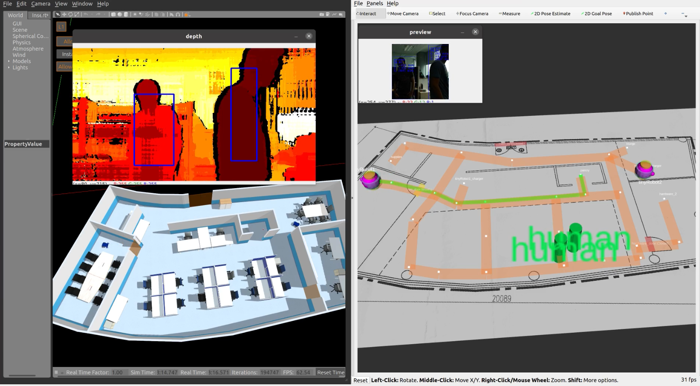

# rmf_human_detector_oakd

## The reposity has been archived. The latest version of this package can be found at [rmf_obstacle_detectors](https://github.com/open-rmf/rmf_obstacle_detectors)

A ROS 2 node that detects humans via on-chip-inference on `OAK-D` cameras and publishes the detections over `/rmf_obstacles` as `rmf_obstacle_msgs::Obstacles` message.

